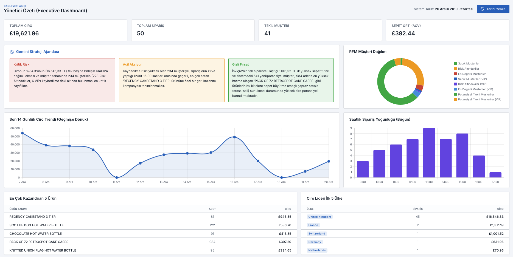
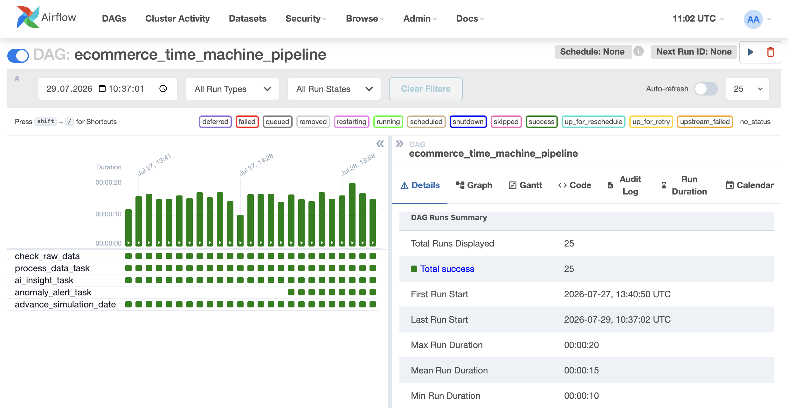

# Otonom E-Ticaret Veri Boru Hattı ve Yapay Zeka Komuta Merkezi
(Autonomous E-Commerce Data Pipeline & AI Dashboard)

Bu proje, ham e-ticaret satış verilerini otomatik olarak işleyen, müşteri sadakati (RFM) analizi yapan, yapay zeka ile stratejik içgörüler üreten ve sistemdeki anomalileri anlık olarak Telegram üzerinden bildiren bir Apache Airflow projesidir.

Sistem tamamen mikroservis mimarisine uygun olarak **Docker Compose** ile tek tuşla ayağa kalkacak şekilde tasarlanmıştır.

##  Öne Çıkan Özellikler (Features)
* **Veri Çekimi:** Projede sürekli akan (stream) uygun bir canlı veri kaynağı bulamadığım için yerine, statik ve yapmak istediğim proje için uygun bir e-ticaret satış veri seti kullandım. Sistemi veri setindeki ilk sipariş tarihinden başlatarak, manuel tetiklemelerle (trigger) bir canlı veri akışı simüle ettim.
* **ETL Süreçleri:** Apache Airflow kullanılarak günlük KPI'lar ve Kümülatif RFM (Recency, Frequency, Monetary) segmentasyonları PostgreSQL'e UPSERT mantığıyla işlenir.
* **LLM Entegrasyonu (Gemini AI):** Günlük veriler Google Gemini API'sine gönderilir; sistemdeki gizli fırsatlar, kritik riskler ve acil eylem planları otonom olarak üretilir.
* **Veri Gözlemciliği (Data Observability):** Satışlarda %50'den fazla ani bir düşüş veya artış yaşandığında Telegram Botu aracılığıyla anlık mobil bildirim gönderilir.
* **Ayrık (Decoupled) Sunum Katmanı:** Veriler FastAPI ile dışarı açılır ve Tabler tabanlı, asenkron çalışan şık bir Dashboard üzerinden görselleştirilir.

##  Mimari ve Teknolojiler (Tech Stack)
* **Orkestrasyon:** Apache Airflow
* **Veritabanı:** PostgreSQL (JSONB desteği ile)
* **Backend API:** FastAPI & Uvicorn
* **Yapay Zeka:** Google Generative AI (Gemini 3.5 Flash)
* **Frontend:** HTML5, Bootstrap 5, Vanilla JS, Chart.js, Tabler UI
* **Konteynerizasyon:** Docker & Docker Compose
* **Bildirim:** Telegram API




##  Proje Dizin Yapısı (Folder Structure)
```text
├── dags/
│   └── ecommerce_pipeline.py    # Airflow DAG dosyası
├── scripts/
│   ├── process_data.py          # Veri temizleme ve RFM hesaplama (Pandas)
│   ├── ai_action.py             # Gemini LLM istekleri
│   └── alert_bot.py             # Telegram anomali tespit scripti
│   └── init_db.py               # Gerekli veritabanı tablolarının oluşturulması
├── api/
│   ├── main.py                  # FastAPI uygulaması
│   ├── requirements.txt         # API bağımlılıkları
│   └── Dockerfile               # Backend konteyner imajı
├── frontend/
│   ├── index.html               # Tabler Dashboard
│   ├── index2.html              # Tabler Dashboard denemesi
│   └── Dockerfile               # Nginx konteyner imajı
└── docker-compose.yml           # Tüm sistemin orkestrasyonu
